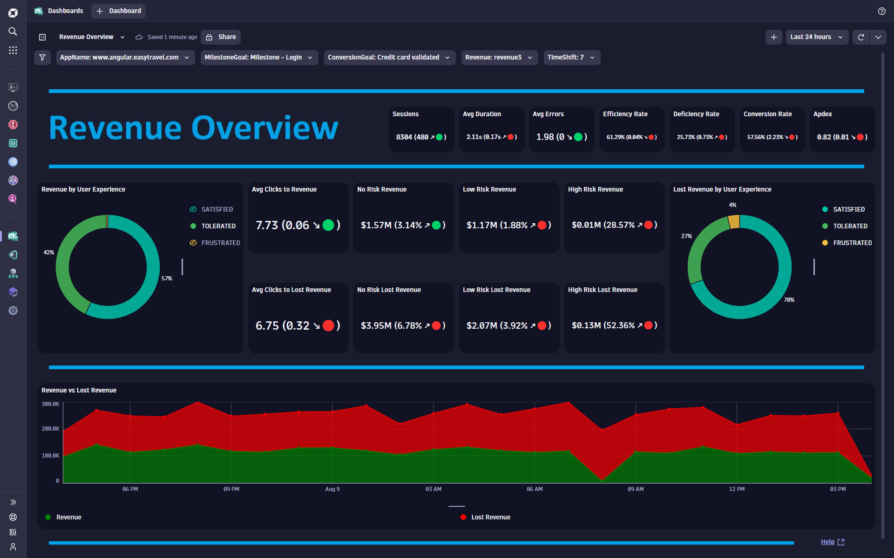
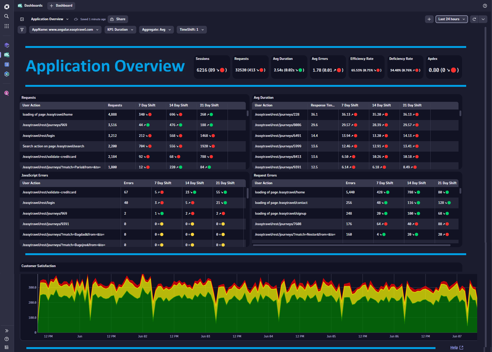
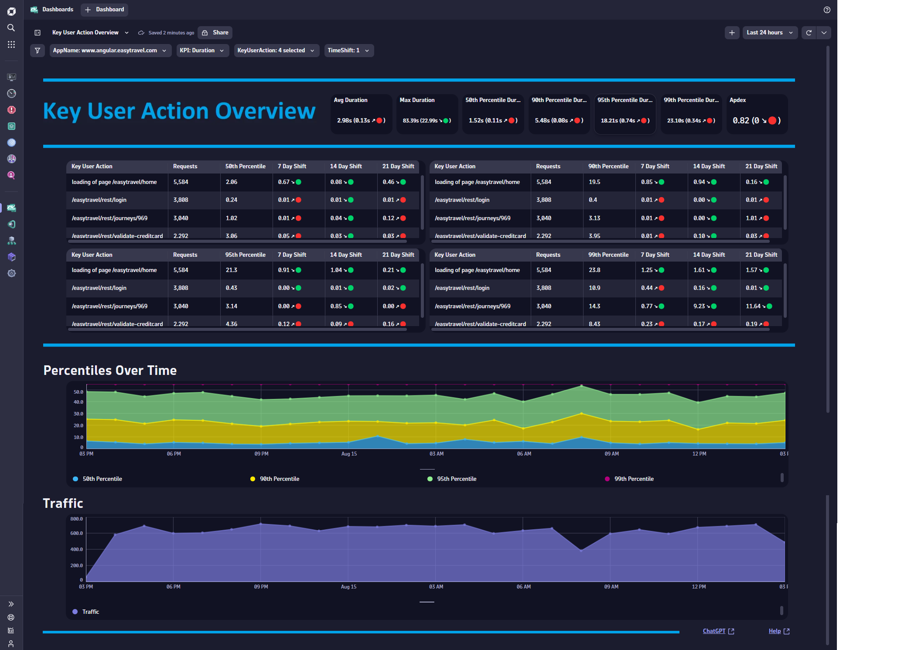
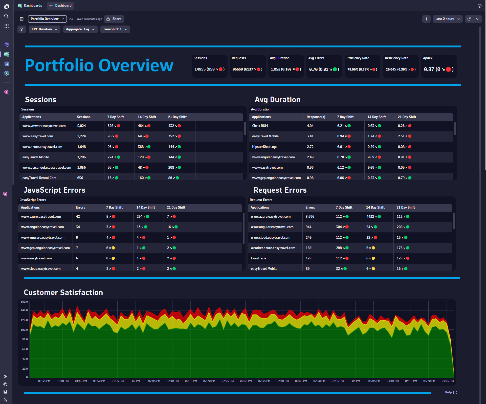
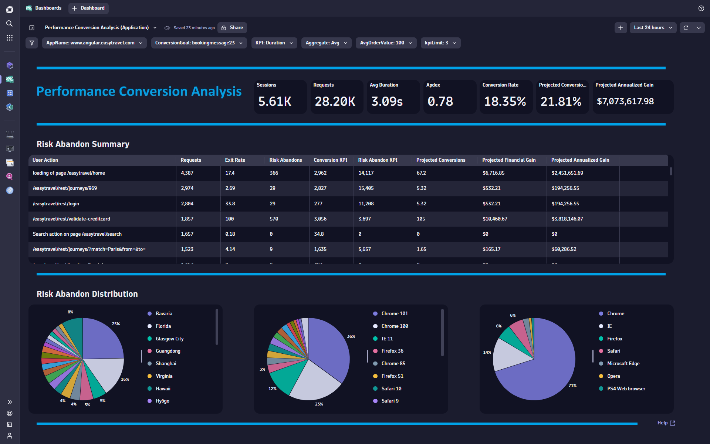
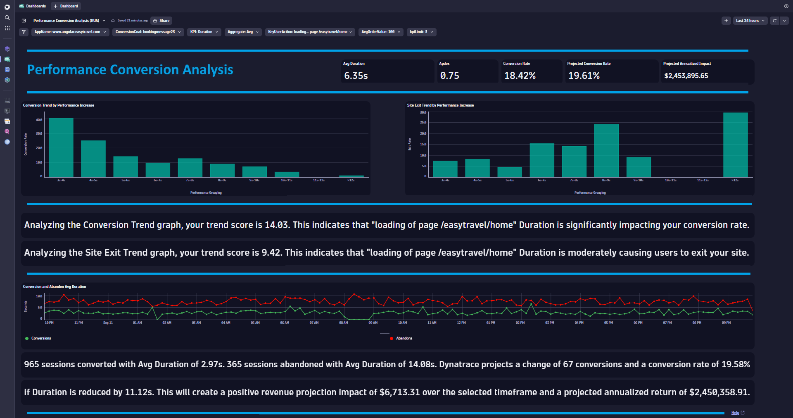

# Self-Service Business Dashboards

Access the [Self-Service Business Dashboard](https://wkf10640.apps.dynatrace.com/ui/document/v0/#share=f1162059-d99b-46e1-826e-765f848dd1eb) shown in the session on the Dynatrace Playground Tenant!

## Video / Content

This repo provides Business Grade Dashboards for Dynatrace Gen3. Click on any Dashboard ReadMe file for a detailed description of the Dashboard, Use Cases, Install Instructions and much more. You can download/upload any content and use the dashboard as is. Or you can take certain portions of the dashboard, remove/add content to fit your specific use case. If you are interested in building your own content from scratch within your wireframe, here are a few tile and variable examples to get you started.

## Code Tile Examples

- [Single Value](./SingleValue.json) 
- [Table](./Table.json) 
- [Categorical Bar Chart](./CBC.json) 
- [Timeseries Chart](./TSC.json) 
- [Pie Chart](./PC.json)

## Code Variable Examples

- [Applications](./Apps.json) 
- [FrictionKPI](./FrictionVariable.json) 

## Business Dashboard Content Library

- [Executive Overview Dashboard](./ReadMeExecutiveOverview.md)

- [Conversion Overview Dashboard](./ReadMeConversionOverview.md)

- [Revenue Overview Dashboard](./ReadMeRevenueOverview.md)

- [Application Business Overview Dashboard](./ReadMeApplicationBusinessOverview.md)

- [Application Overview Dashboard](./ReadMeApplicationOverview.md)

- [Key User Action Overview Dashboard](./ReadMeKUAOverview.md)

- [Core Web Vitals Overview Dashboard](./ReadMeCoreWebVitalsOverview.md)

- [Portfolio Overview Dashboard](./ReadMePortfolioOverview.md)

- [Performance Conversion Analysis (Application) Dashboard](./ReadMePerformanceConversionAnalysisApplication.md)

- [Performance Conversion Analysis (KUA) Dashboard](./ReadMePerformanceConversionAnalysisKUA.md)

