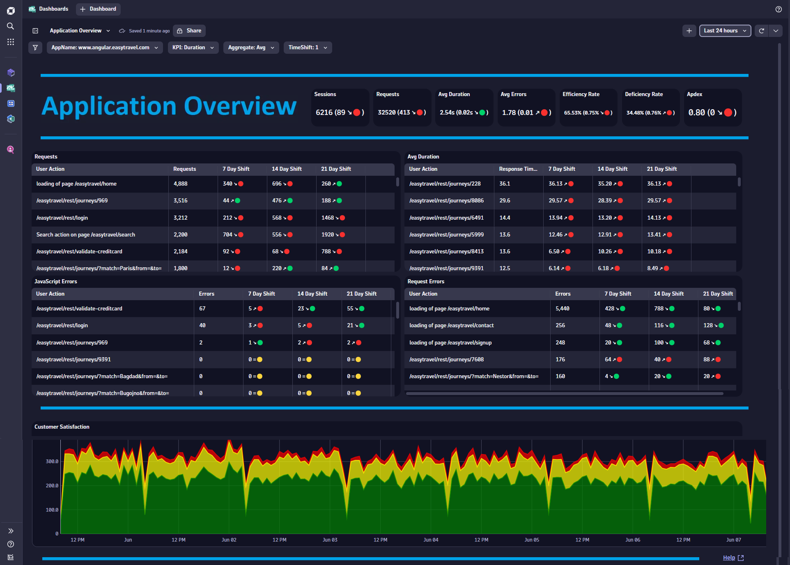
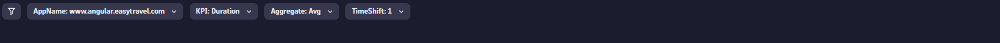
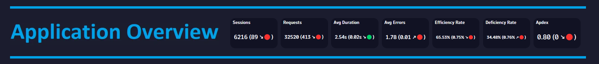
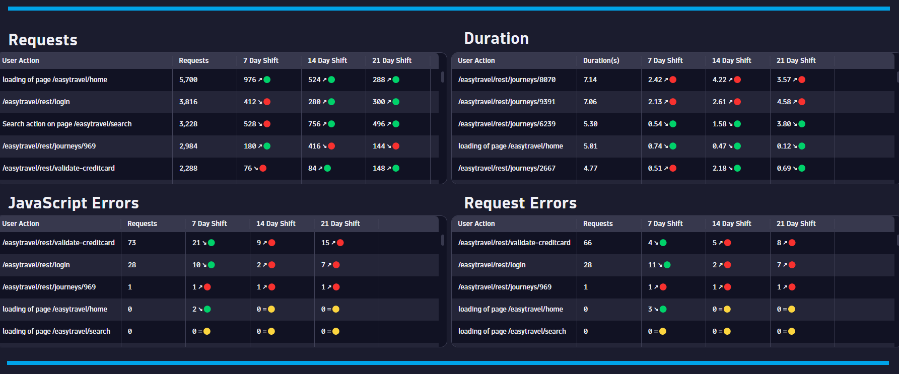
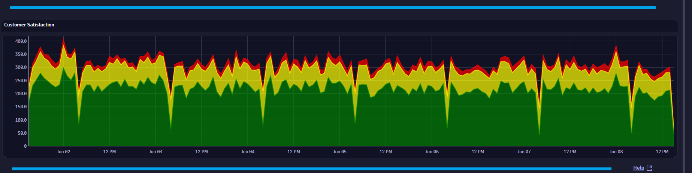

# Application Overview Dashboard
This dashboard provides an executive level overview for an Application.

# Prerequisites

None.

# Target Audience

- Application Owner
- Line of Business
- Executive

# Use Cases

- Is my user traffic increasing?
- Do I have application efficiency issues?
- Do I have any poor performance trend issues?
- Do I have any error trend issues?
- Is my application experiencing high error rates?
- Is my application suffering from poor performance?
- What days/times do I have good user experiences?

# Install Instructions

- Download [Dashboard JSON](https://github.com/TechShady/Dynatrace-Dashboards-Gen3/blob/main/Application%20Overview.json)
- Launch the new Gen3 UI
- Select the Dashboard app
- In the upper righthand corner, select Upload and select your json file
- Refresh your dashboard list and launch your Dashboard

# User Guide

The Application Overview Dashboard is broken down into four sections.

The dashboard header section has four filters that you can apply to your Executive Overview Dashboard:
- AppName - List of applications currently monitored by Dynatrace that have conversion goals defined. Select the application to filter the dashboard for any application. 
- KPI - List of KPI metrics (i.e. Duration). Select a KPI to apply as a filtert to your dashboard.
- Aggregate - List of aggregation values (i.e. AVG). Select an aggregate to apply as a filtert to your dashboard.
- TimeShift - Value in days used by metrics to compare against. For example, a value of 7 will compare the KPI based on the current timeframe and compare that value to the same timeframe shifted by 7 days.

The top section is called the KPI banner. This section has the following KPIs:
- Avg Duration: Time between the initial user input and complete page load.
- Avg Errors: Average number of Request and JavaScript Errors.
- Efficiency Rate: Rate of sessions with good user experience. A perfect efficiency rate is 100.
- Deficiency Rate: Rate of sessions with poor user experience. A perfect deficiency rate is 0.
- Sessions: The total number of user sessions for your applications.
- Apdex: Application Performance Index is a standard developed by an alliance of companies for measuring the performance of applications. A perfect Apdex score is 1.

Each KPI cell displays the current value based on the selected timeframe. Each KPI is compared to a time shift that is selected in the TimeShift variable dropdown and will display, in parentheses, the KPI difference and trend direction.

The middle section displays the following tables: 
- Requests - The number of User Action requests for your application.
- Duration - The average User Action Duration for your application.
- JavaScript Errors - The number of JavaScript Errors for your application.
- Request Errors - The number of Request Errors for your application.
 
Each table displays the metric for the current timeframe, 7 day timeshift, 14 day timeshift and 21 day timeshift. This enables trend analysis for each metric.
 

The bottom section charts customer satisfaction (Satisfied, Tolerated, Frustrated) over the current timeframe.
