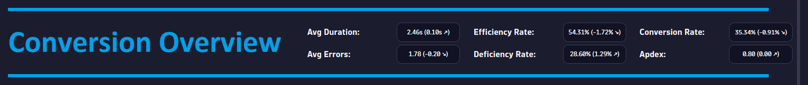
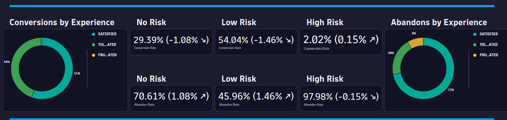
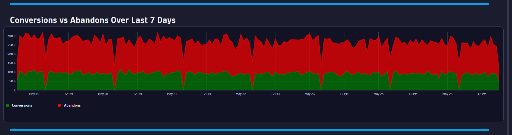

# Conversion Overview Dashboard
This dashboard provides an executive level overview and risk assessment on application conversions.

# Prerequisites

Required: [Create a conversion goal](https://www.dynatrace.com/support/help/platform-modules/digital-experience/web-applications/analyze-and-use/define-conversion-goals) for a user action that indicates the start of a business transaction (i.e. Login Page).

Required: [Create a conversion goal](https://www.dynatrace.com/support/help/platform-modules/digital-experience/web-applications/analyze-and-use/define-conversion-goals) for a user action that indicates a completed business transaction (i.e. Order Confirmation Page).

# Target Audience

- Application Owner
- Line of Business
- Executive

# Use Cases

- Is user experience impacting my conversion rate?
- Do I have conversion risk due to user experience?
- Are performance and error trends impacting my conversion rate?
- Do I have conversion rate drops during certain timeframes?
- What days/times do I have good conversion rates?
- Are my users converting efficiently? 
- Does a change in my APDEX score impact my conversion rate?

# Install Instructions

- Download [Dashboard JSON](https://github.com/TechShady/Dynatrace-Dashboards-Gen3/blob/main/Conversion%20Overview.json)
- Launch the new Gen3 UI
- Select the Dashboard app
- In the upper righthand corner, select Upload and select your json file
- Refresh your dashboard list and launch your Dashboard

# User Guide

The Conversion Overview Dashboard is broken down into four sections.

The dashboard header section has four filters that you can apply to your Conversion Overview Dashboard:
- AppName - List of applications currently monitored by Dynatrace. Select the application to filter the dashboard for any application.
- MilestoneGoal - List of conversion goals. Select the conversion goal that indicates the start of a business transaction.
- ConversionGoal - List of conversion goals. Select the conversion goal that indicates the completion of a business transaction.
- TimeShift - Value in days used by metrics to compare against. For example, a value of 7 will compare the KPI based on the current timeframe and compare that value to the same timeframe shifted by 7 days.

The top section is called the KPI banner. This section has the following KPIs:
- Avg Duration: Time between the initial user input and complete page load.
- Avg Errors: Average number of Request and JavaScript Errors.
- Efficiency Rate: Rate of sessions that converted with good user experience. A perfect efficiency rate is 100.
- Deficiency Rate: Rate of sessions that abandoned with poor user experience. A perfect deficiency rate is 0.
- Conversion Rate: Rate of sessions that converted.
- Apdex: Application Performance Index is a standard developed by an alliance of companies for measuring the performance of applications. A perfect Apdex score is 1.

Each KPI cell displays the current value based on the selected timeframe. Each KPI is compared to a time shift that is selected in the TimeShift variable dropdown and will display, in parentheses, the KPI difference and trend direction.

The middle section is broken down into three sections. The far-left section contains a donut chart tile with percent breakdowns for Satisfied, Tolerated or Frustrated conversions. The far-right section contains a donut chart tile with percent breakdowns for Satisfied, Tolerated or Frustrated abandons. The middle section contains KPI metric rates (with comparison to a seven-day time shift) for: 
- No Risk Conversion Rate - Conversion Rate for Satisfied Sessions.
- Low Risk Conversion Rate - Conversion Rate for Tolerated Sessions.
- High Risk Conversion Rate - Conversion Rate for Frustrated Sessions.
- No Risk Abandon Rate - Abandon Rate for Satisfied Sessions.
- Low Risk Abandon Rate - Abandon Rate for Tolerated Sessions.
- High Risk Abandon Rate - Abandon Rate for Frustrated Sessions.
 

The bottom section charts conversion and abandon counts over the last seven days.
