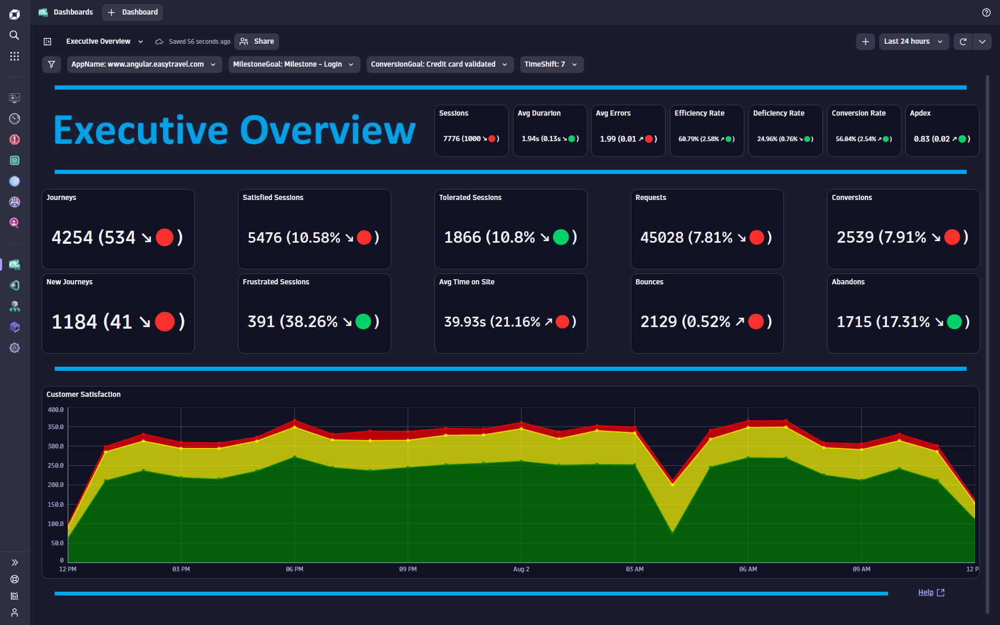
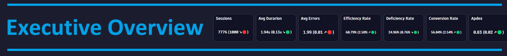
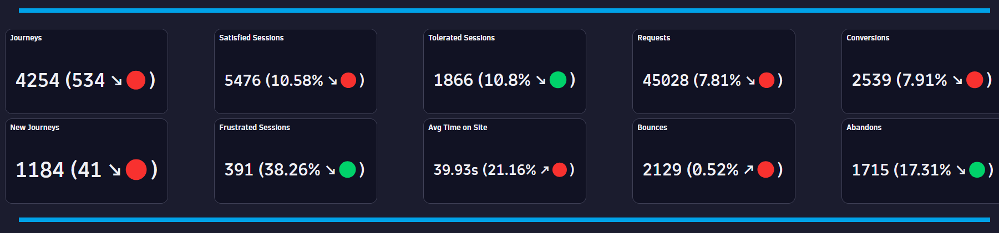
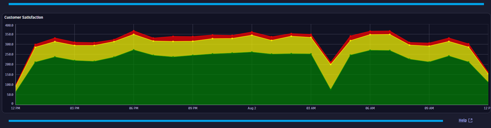

# Executive Overview Dashboard
This dashboard provides an executive level overview on KPIs and Customer Experience.

# Prerequisites

Required: [Create a conversion goal](https://www.dynatrace.com/support/help/platform-modules/digital-experience/web-applications/analyze-and-use/define-conversion-goals) for a user action that indicates the start of a business transaction (i.e. Login Page).

Required: [Create a conversion goal](https://www.dynatrace.com/support/help/platform-modules/digital-experience/web-applications/analyze-and-use/define-conversion-goals) for a user action that indicates a completed business transaction (i.e. Order Confirmation Page).

# Target Audience

- Application Owner
- Line of Business
- Executive

# Use Cases

- Are performance issues impacting my customer experience?
- Are errors impacting my customer experience?
- Are performance and error trends impacting my customer experience?
- Are my KPIs trending in the right direction?
- What days/times do I have good customer experience?
- Are my users converting efficiently? 
- Does a change in my APDEX score impact my customer experience?
- Are my users staying engaged?
- Do I have user satisfaction problems/trends?
- Is my traffic trending in the right direction?
- Is my bounce rate normal and trending in the right direction?

# Install Instructions

- Download [Dashboard JSON](https://github.com/TechShady/Dynatrace-Dashboards-Gen3/blob/main/Executive%20Overview.json)
- Launch the new Gen3 UI
- Select the Dashboard app
- In the upper righthand corner, select Upload and select your json file
- Refresh your dashboard list and launch your Dashboard

# User Guide

The Executive Overview Dashboard is broken down into four sections.

The dashboard header section has four filters that you can apply to your Executive Overview Dashboard:
- AppName - List of applications currently monitored by Dynatrace that have conversion goals defined. Select the application to filter the dashboard for any application. 
- MilestoneGoal - List of conversion goals. Select the conversion goal that indicates the start of a business transaction.
- ConversionGoal - List of conversion goals. Select the conversion goal that indicates the completion of a business transaction.
- TimeShift - Value in days used by metrics to compare against. For example, a value of 7 will compare the KPI based on the current timeframe and compare that value to the same timeframe shifted by 7 days.

The top section is called the KPI banner. This section has the following KPIs:
- Avg Duration: Time between the initial user input and complete page load.
- Avg Errors: Average number of Request and JavaScript Errors.
- Efficiency Rate: Rate of sessions that converted with good user experience. A perfect efficiency rate is 100.
- Deficiency Rate: Rate of sessions that abandoned with poor user experience. A perfect deficiency rate is 0.
- Conversion Rate: Rate of sessions that converted.
- Apdex: Application Performance Index is a standard developed by an alliance of companies for measuring the performance of applications. A perfect Apdex score is 1.

Each KPI cell displays the current value based on the selected timeframe. Each KPI is compared to a time shift that is selected in the TimeShift variable dropdown and will display, in parentheses, the KPI difference and trend direction.

The middle section KPI metrics (with comparison to a seven-day time shift) for: 
- Sessions - Total number of user sessions.
- New Sessions - Total number of new user sessions.
- Satisfied Sessions - Total number of user sessions that had a user experience score of SATISFIED.
- Tolerated Sessions - Total number of user sessions that had a user experience score of TOLERATED.
- Frustrated Sessions - Total number of user sessions that had a user experience score of FRUSTRATED.
- Avg Time On Site - Average session duration.
- Requests - Total number of user actions.
- Bounces - Total number of user sessions that bounced from the web site.
- Conversions - Total number of user sessions that reached the conversion goal.
- Abandons - Total number of user sessions that did not reach the conversion goal.

Each KPI cell displays the current value based on the selected timeframe. Each KPI is compared to a time shift that is selected in the TimeShift variable dropdown and will display, in parentheses, the KPI difference and trend direction.

The bottom section charts customer satisfaction over the selected timeframe.
