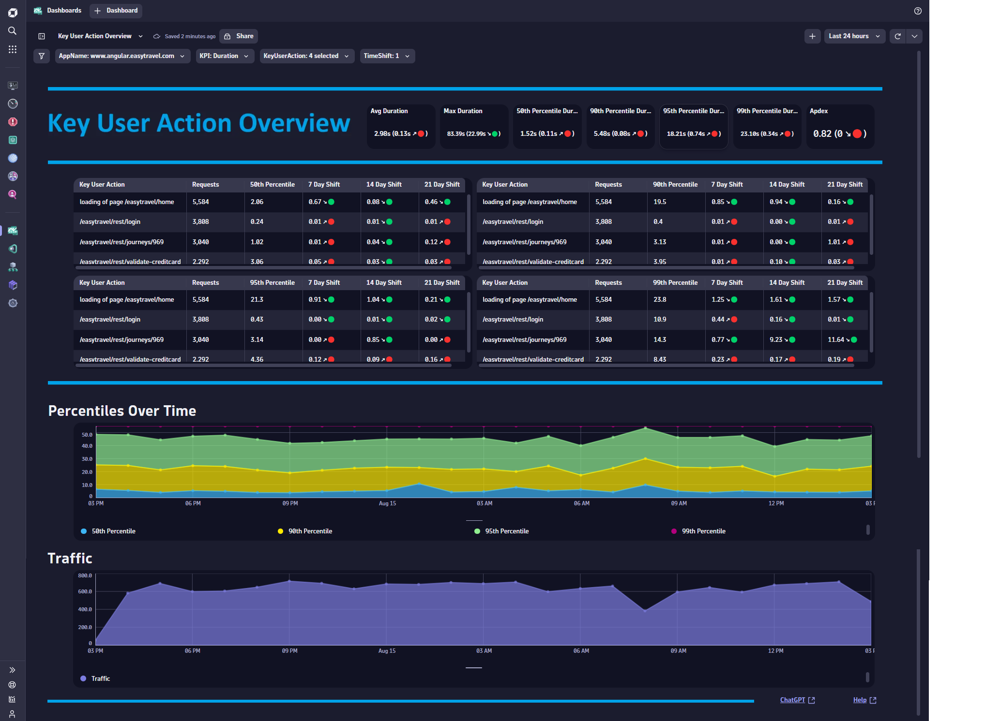
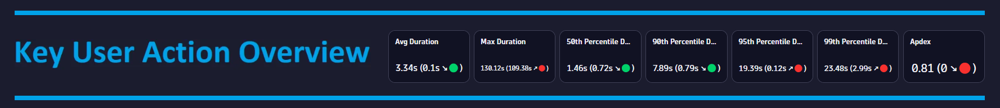
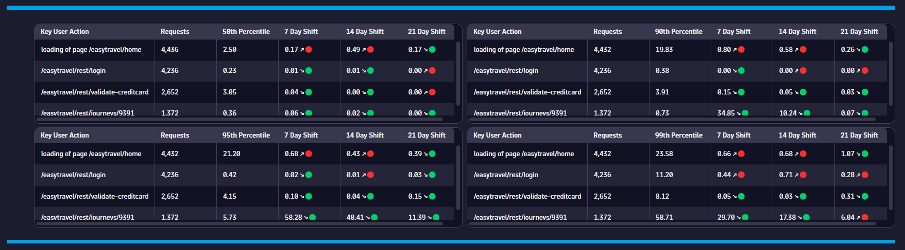

# Key User Action Overview Dashboard
This dashboard provides an overview for your Key User Actions.

# Prerequisites

None.

# Target Audience

- Application Owner
- Line of Business
- Web Developer

# Use Cases

- Are any of my Key User Actions trending in the wrong direction?
- Do I have performance impact at certain percentiles?
- Do I have any poor performance trend issues?
- Is my application suffering from poor performance?
- What days/times do I have good Key User Action performance?
- What Key User Actions need to be optimized?

# Install Instructions

- Download [Dashboard JSON](https://github.com/TechShady/Dynatrace-Dashboards-Gen3/blob/main/Key%20User%20Action%20Overview.json)
- Launch the new Gen3 UI
- Select the Dashboard app
- In the upper righthand corner, select Upload and select your json file
- Refresh your dashboard list and launch your Dashboard

# User Guide

The Key User Action Overview Dashboard is broken down into four sections.

The dashboard header section has four filters that you can apply to your Key User Action Overview Dashboard:
- AppName - List of applications currently monitored by Dynatrace. Select the application to filter the dashboard for any application.
- KPI - List of KPIs used in analysis (i.e. Duration, Visually Complete Time).
- KeyUserAction - A list of key user actions that you can analyze.
- TimeShift - Value in days used by metrics to compare against. For example, a value of 7 will compare the KPI based on the current timeframe and compare that value to the same timeframe shifted by 7 days.

The top section is called the KPI banner. This section has the following KPIs:
- Avg (KPI): Average response time for the selected KPI.
- Max (KPI): Max response time for the selected KPI.
- 50th Percentile (KPI): 50th Percentile response time for the selected KPI.
- 90th Percentile (KPI): 90th Percentile response time for the selected KPI.
- 95th Percentile (KPI): 95th Percentile response time for the selected KPI.
- 99th Percentile (KPI): 99th Percentile response time for the selected KPI.
- Apdex: Application Performance Index is a standard developed by an alliance of companies for measuring the performance of applications. A perfect Apdex score is 1.

Each KPI cell displays the current value based on the selected timeframe. Each KPI is compared to a time shift that is selected in the TimeShift variable dropdown and will display, in parentheses, the KPI difference and trend direction.

The middle section displays the following tables: 
- 50th Percentile
- 90th Percentile
- 95th Percentile
- 99th Percentile
 
 Each table displays the metric value  based on the selected timeframe, 7 day timeshift, 14 day timeshift and 21 day timeshift. This enables trend analysis for each percentile.
 

The bottom section charts the 50th, 90th, 95th and 99th Percentiles, and Traffic over selected timeframe.
