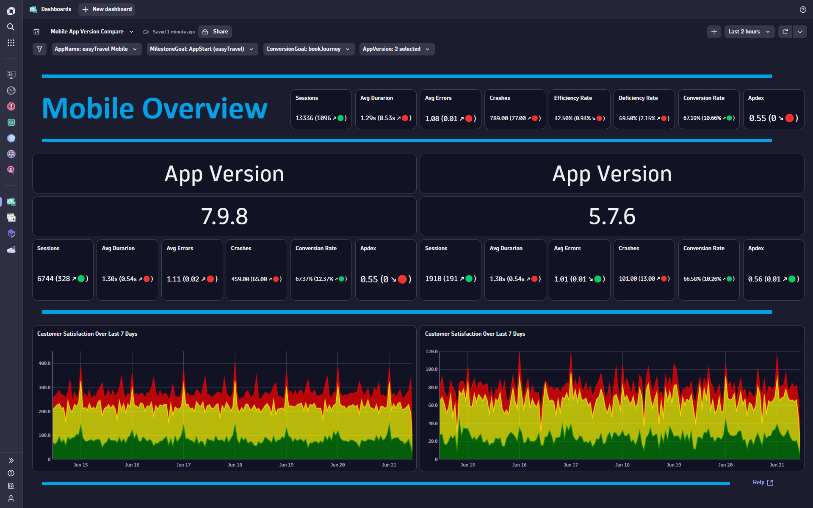
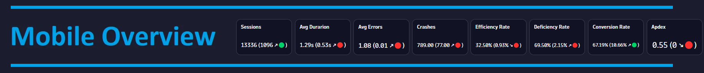
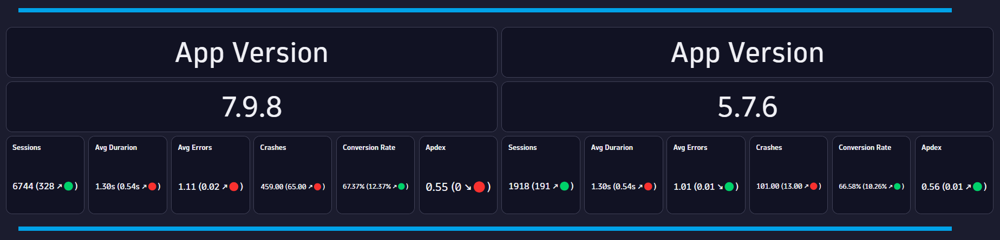
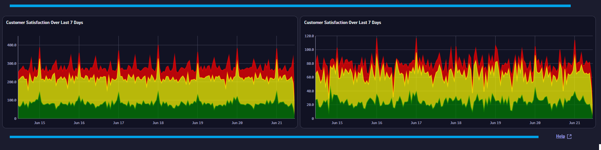

# Mobile App Version Compare Overview Dashboard
This dashboard provides an App Version comparison for Mobile Applications.

# Prerequisites

None.

# Target Audience

- Application Owner
- Line of Business
- Executive
- Mobile App Developer

# Use Cases

- Are performance issues impacting my customer experience for a certain App Versiomn?
- Which App Version performs best?
- Which App Version has the most traffic?
- Which App Version has the highest number of crashes?
- Which App Version has the best customer experience?
- Which App Version has the most errors?
- Which App Version is performing better compared to last week?

# Install Instructions

- Download https://github.com/TechShady/Dynatrace-Dashboards-Gen3/blob/main/Mobile%20App%20Version%20Compare.json
- Launch the new Gen3 UI
- Select the Dashboard app
- In the upper righthand corner, select Upload and select your json file
- Refresh your dashboard list and launch your Dashboard

# User Guide

The Mobile App Version Compare Overview Dashboard is broken down into four sections.

The dashboard header section has four filters that you can apply to your Executive Overview Dashboard:
- AppName - List of mobile applications currently monitored by Dynatrace. Select the application to filter the dashboard for any mobile application.
- MilestoneGoal - List of conversion goals. Select the conversion goal that indicates the start of a business transaction.
- ConversionGoal - List of conversion goals. Select the conversion goal that indicates the completion of a business transaction.
- AppVersion - List of App Versions used in the middle section. Select two App Versions for comparison.

The top section is called the KPI banner. This section has the following KPIs:
- Sessions: Total number of users that have launched your Mobile App.
- Avg Duration: Time between the initial user input and completed load.
- Avg Errors: Average number of Errors.
- Crashes: Total number of Mobile App crashes.
- Efficiency Rate: Rate of sessions that converted with good user experience. A perfect efficiency rate is 100.
- Deficiency Rate: Rate of sessions that abandoned with poor user experience. A perfect deficiency rate is 0.
- Conversion Rate: Rate of sessions that converted.
- Apdex: Application Performance Index is a standard developed by an alliance of companies for measuring the performance of applications. A perfect Apdex score is 1.

Each KPI cell displays the current value for the last 24 hours. Each KPI is compared to a seven-day time shift over the past 24 hours and will display, in parentheses, the KPI difference and trend direction.

The middle section has the following KPI for each App Version: 
- Sessions: Total number of users that have launched your Mobile App.
- Avg Duration: Time between the initial user input and completed load.
- Avg Errors: Average number of Errors.
- Crashes: Total number of Mobile App crashes.
- Conversion Rate: Rate of sessions that converted.
- Apdex: Application Performance Index is a standard developed by an alliance of companies for measuring the performance of applications. A perfect Apdex score is 1.

Each KPI cell displays the current value for the last 24 hours. Each KPI is compared to a seven-day time shift over the past 24 hours and will display, in parentheses, the KPI difference and trend direction.

The bottom section charts customer satisfaction over the last seven days for each App Version.
