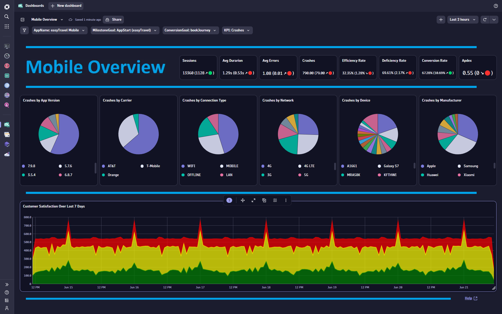

# Mobile Overview Dashboard
This dashboard provides an executive level overview on KPIs and Customer Experience for Mobile Applications.

# Prerequisites

None.

# Target Audience

- Application Owner
- Line of Business
- Executive
- Mobile App Developer

# Use Cases

- Are performance issues impacting my customer experience?
- Are errors impacting my mobile app?
- Are performance and error trends impacting my customer experience?
- Are my KPIs trending in the right direction?
- What days/times do I have good customer experience?
- Are my users converting efficiently? 
- Does a change in my APDEX score impact my customer experience?
- Are crashes happening more in the latest app version?
- Are crashes more common for a certain Carrier, Network or Device?
- What Network has the poorest duration?
- What Manufactor has the most errors?

# Install Instructions

- Download https://github.com/TechShady/Dynatrace-Dashboards-Gen3/blob/main/Mobile%20Overview.json
- Or Download V2 (removes timeseries graph and adds more pie charts) https://github.com/TechShady/Dynatrace-Dashboards-Gen3/blob/main/Mobile%20Overview%20V2.json
- Launch the new Gen3 UI
- Select the Dashboard app
- In the upper righthand corner, select Upload and select your json file
- Refresh your dashboard list and launch your Dashboard

# User Guide

The Mobile Overview Dashboard is broken down into four sections.

The dashboard header section has four filters that you can apply to your Executive Overview Dashboard:
- AppName - List of mobile applications currently monitored by Dynatrace. Select the application to filter the dashboard for any mobile application.
- MilestoneGoal - List of conversion goals. Select the conversion goal that indicates the start of a business transaction.
- ConversionGoal - List of conversion goals. Select the conversion goal that indicates the completion of a business transaction.
- KPI - List of KPIs used in the middle section. Values: Crashes, Duration & Errors.

The top section is called the KPI banner. This section has the following KPIs:
- Sessions: Total number of users that have launched your Mobile App.
- Avg Duration: Time between the initial user input and completed load.
- Avg Errors: Average number of Errors.
- Crashes: Total number of Mobile App crashes.
- Efficiency Rate: Rate of sessions that converted with good user experience. A perfect efficiency rate is 100.
- Deficiency Rate: Rate of sessions that abandoned with poor user experience. A perfect deficiency rate is 0.
- Conversion Rate: Rate of sessions that converted.
- Apdex: Application Performance Index is a standard developed by an alliance of companies for measuring the performance of applications. A perfect Apdex score is 1.

Each KPI cell displays the current value for the last 24 hours. Each KPI is compared to a seven-day time shift over the past 24 hours and will display, in parentheses, the KPI difference and trend direction.

The middle section pie charts for: 
- App Version
- Carrier
- Connection Type
- Network
- Device
- Manufacter

The bottom section charts customer satisfaction over the last seven days.
