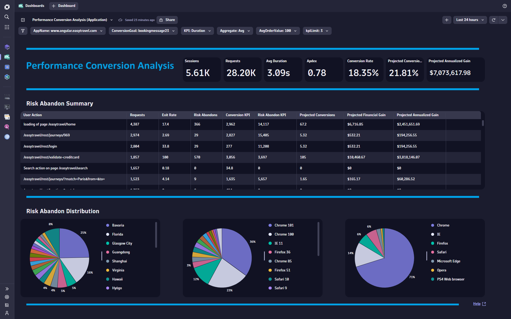
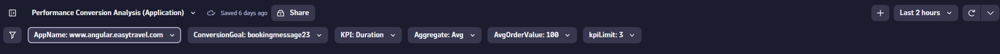
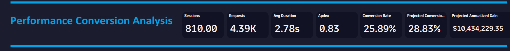
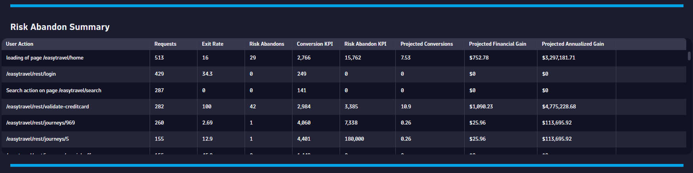
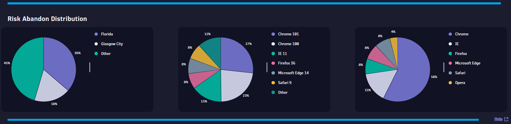

# Performance Conversion Analysis (Application) Dashboard

This dashboard provides a performance conversion analysis for your applications and tells you if the performance for any User Action impacts your conversion rate.

# Prerequisites

Required: [Create a session property](https://www.dynatrace.com/support/help/platform-modules/digital-experience/custom-applications/additional-configuration/define-custom-action-and-session-properties) for your conversion page (i.e. String: OrderCompleted).

# Target Audience

- Application Owner
- Line of Business
- Executive
- Web Developer

# Use Cases

-	Do I have a problem with my website?
-	Is this problem impacting my users?
-	What KPI is causing the problem?
-	What user action(s) do I need to tune?
-	How much improvement do I need to achieve to maximize conversions?
-	How much is this problem costing my business?
-	How do I fix this problem?

# Install Instructions

- Download [Dashboard JSON](https://github.com/TechShady/Dynatrace-Dashboards-Gen3/blob/main/Performance%20Conversion%20Analysis%20(Application).json)
- Launch the new Gen3 UI
- Select the Dashboard app
- In the upper righthand corner, select Upload and select your json file
- Refresh your dashboard list and launch your Dashboard

# User Guide

The Performance Conversion Analysis (Application) Dashboard is broken down into four sections.

The dashboard header section has six filters that you can apply to your Conversion Friction Analysis Dashboard and one filter (KPI) that automatically determines the KPI that has the greatest impact on your conversion rate:
- AppName - List of applications currently monitored by Dynatrace. Select the application to filter the dashboard for any application.
- ConversionGoal - Your session property for Conversion. Change this value after deploy to match the session property that was created for you application to track a converted session.
- KPI - This filter automatically determines the KPI that has the greatest impact on your conversion rate.
- Aggregate - KPI aggregation. Select Avg or Median.
- AvgOrderValue - Select your average order value. If your application is not revenue generating, then select a value that reflects the internal cost associated with your business transaction. You can also modify the value list to add/adjust values presented.
- kpiLimit - This is a filter limit for the KPI with respect to abandons. For example, selecting a value of 3 will only consider sessions that abandonded and had their KPI (i.e. Duration) greater than 3 seconds on their exit action.

The top section is called the KPI banner. This section has the following KPIs:
- Sessions: Total number of user sessions.
- Requests: Total number of user actions.
- KPI: Average or Median for the KPI selected in the variable dropdowns for KPI and Aggregate.
- APDEX: Application Performance Index is a standard developed by an alliance of companies for measuring the performance of applications. A perfect Apdex score is 1.
- Conversion Rate: Rate of sessions that converted.
- Projected Conversion Rate: Rate of sessions that are projected to convert if the KPI problem is neutralized.
- Projected Revenue Impact: Projected increase in revenue over seven days if the KPI problem is neutralized.

The middle section provides a detailed summary about each user action and how the KPI is impacting on your conversion rate. The summary will tell you the difference between converting and abandoning sessions and will project improvements if the difference is neutralized. 

The bottom section displays a distribution for risk abandons for GEO, Browser Family and Browser Type, and the Help link provides dashboard help.
