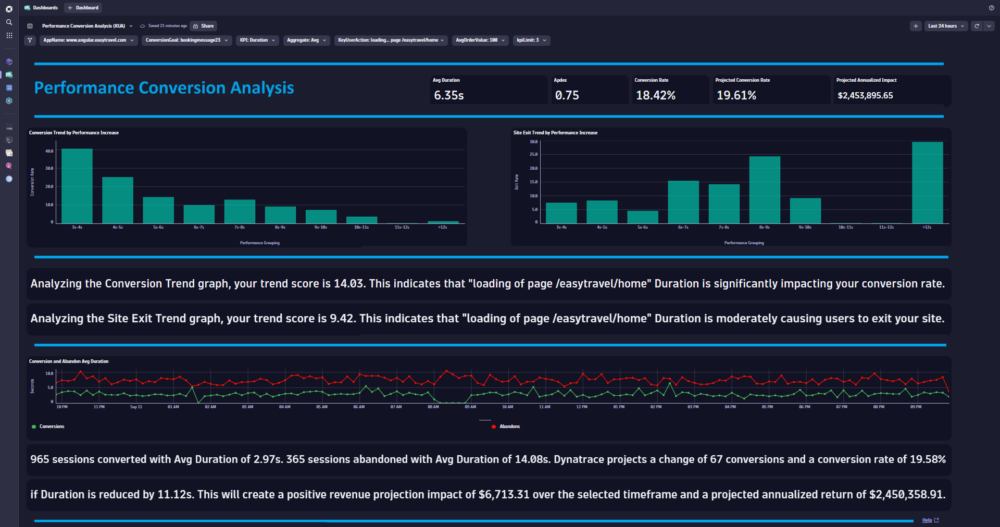
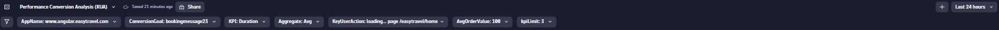
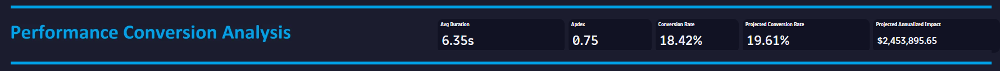
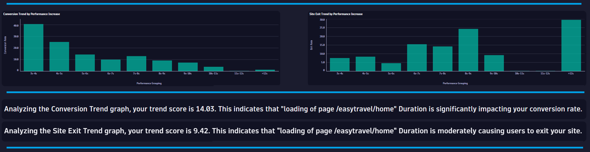
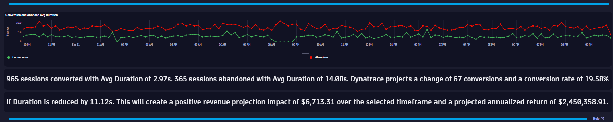

# Performance Conversion Analysis (KUA) Dashboard
This dashboard provides a performance conversion analysis for your applications and tells you if the performance for a certain User Action impacts your conversion rate.

# Prerequisites

Required: [Create a session property](https://www.dynatrace.com/support/help/platform-modules/digital-experience/custom-applications/additional-configuration/define-custom-action-and-session-properties) for your conversion page (i.e. String: OrderCompleted).

# Target Audience

- Application Owner
- Line of Business
- Executive
- Web Developer

# Use Cases

- What is the APDEX for my Key User Action?
- Is my user traffic increasing?
- Does the performance of my Key User Action impacting my Conversion Rate?
- Are users that interract with my Key User Action converting efficiently?
- What is the optimal performance for my Key User Action with respect to conversions?

# Install Instructions

- Download [Dashboard JSON](https://github.com/TechShady/Dynatrace-Dashboards-Gen3/blob/main/Performance%20Conversion%20Analysis%20(KUA).json)
- Launch the new Gen3 UI
- Select the Dashboard app
- In the upper righthand corner, select Upload and select your json file
- Refresh your dashboard list and launch your Dashboard
- Modify the ConversionGoal variable filter and replace with your conversion session property

# User Guide

The Performance Conversion Analysis (KUA) Dashboard is broken down into four sections.

The dashboard header section has seven filters that you can apply to your Conversion Friction Analysis Dashboard and one filter (KPI) that automatically determines the KPI that has the greatest impact on your conversion rate:
- AppName - List of applications currently monitored by Dynatrace. Select the application to filter the dashboard for any application.
- ConversionGoal - Your session property for Conversion. Change this value after deploy to match the session property that was created for you application to track a converted session.
- KPI - This filter automatically determines the KPI that has the greatest impact on your conversion rate.
- Aggregate - KPI aggregation. Select Avg or Median.
- Key User Action - Select a USer Action for analysis with respect to conversions.
- AvgOrderValue - Select your average order value. If your application is not revenue generating, then select a value that reflects the internal cost associated with your business transaction. You can also modify the value list to add/adjust values presented.
- kpiLimit - This is a filter limit for the KPI with respect to abandons. For example, selecting a value of 3 will only consider sessions that abandonded and had their KPI (i.e. Duration) greater than 3 seconds on their exit action.

The top section is called the KPI banner. This section has the following KPIs:
- KPI: Average or Median for the KPI selected in the variable dropdowns for KPI and Aggregate.
- APDEX: Application Performance Index is a standard developed by an alliance of companies for measuring the performance of applications. A perfect Apdex score is 1.
- Conversion Rate: Rate of sessions that converted.
- Projected Conversion Rate: Rate of sessions that are projected to convert if the KPI problem is neutralized.
- Projected Revenue Impact: Projected increase in revenue over seven days if the KPI problem is neutralized.

The middle section displays two graphs. The graph on the left shows the conversion trend for each performance level of the user action. If the graph is in a down trend then the user action performance has an impact on the conversion rate. The graph on the right shows the site exit trend for each performance level of the user action. If the graph is in an up trend then the user action performance has an impact on user exiting your site.

Dynatrace automatically analyses each graph (Causal AI), calculates a score and tells you the impact (Substantially, Significantly, Moderately or No Impact) the user action has on conversions and site exits.

The bottom section charts the conversion and abandon rate over time. Below the graph, Dynatrace details the user action performance difference between sessions that converted vs sessions that abandonded. Dynatrace also identifies the improvement in performance that is needed to neturalize the difference and projects the conversion rate and financial gain. In the bottom right corner is a Help link that provides dashboard help.
