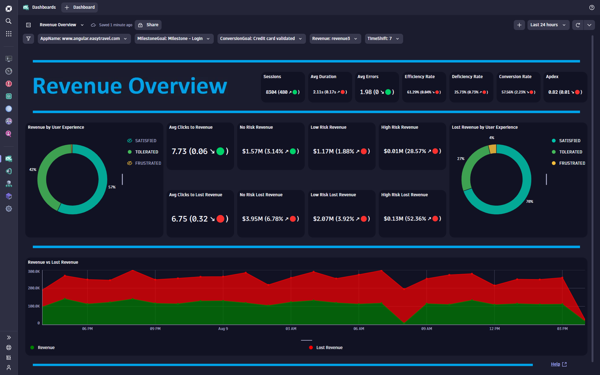
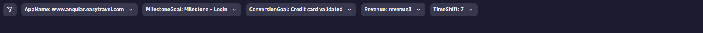
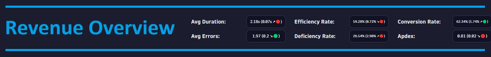
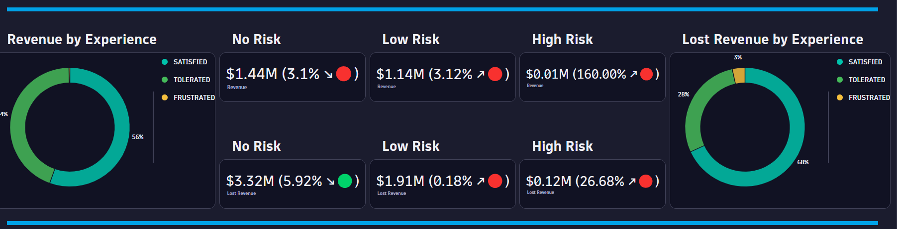
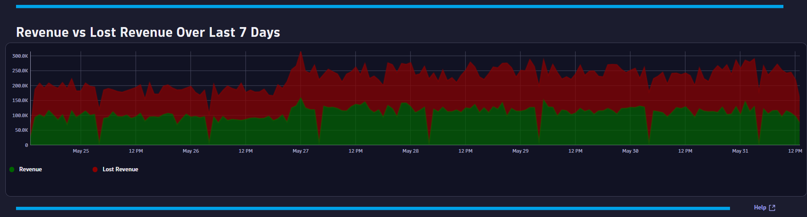

# Revenue Overview Dashboard
This dashboard provides an executive level overview and risk assessment on revenue.

# Prerequisites

Required: [Create a conversion goal](https://www.dynatrace.com/support/help/platform-modules/digital-experience/web-applications/analyze-and-use/define-conversion-goals) for a user action that indicates the start of a business transaction (i.e. Login Page).

Required: [Create a conversion goal](https://www.dynatrace.com/support/help/platform-modules/digital-experience/web-applications/analyze-and-use/define-conversion-goals) for a user action that indicates a completed business transaction (i.e. Order Confirmation Page).

Required: [Create a session property](https://www.dynatrace.com/support/help/platform-modules/digital-experience/custom-applications/additional-configuration/define-custom-action-and-session-properties) for revenue (i.e. Double: CartAmount).

# Target Audience

- Application Owner
- Line of Business
- Executive

# Use Cases

- Is user experience impacting revenue?
- Do I have revenue risk due to user experience?
- Are performance and error trends impacting revenue?
- Do I have low revenue during certain timeframes?
- What days/times do I have good revenue?
- Are my users converting efficiently? 
- Does a change in my APDEX score impact revenue?

# Install Instructions

- Download [Dashboard JSON](https://github.com/TechShady/Dynatrace-Dashboards-Gen3/blob/main/Revenue%20Overview.json)
- Save the json file
- Launch the new Gen3 UI
- Select the Dashboard app
- In the upper righthand corner, select Upload and select your json file
- Refresh your dashboard list and launch your Dashboard
- Modify the Revenue variable filter and replace with your Revenue session property

# User Guide

The Executive Overview Dashboard is broken down into four sections.

The dashboard header section has five filters that you can apply to your Revenue Overview Dashboard:
- AppName - List of applications currently monitored by Dynatrace. Select the application to filter the dashboard for any application.
- MilestoneGoal - List of conversion goals. Select the conversion goal that indicates the start of a business transaction.
- ConversionGoal - List of conversion goals. Select the conversion goal that indicates the completion of a business transaction.
- Revenue - List of session properties (Double). Select your session property for Revenue. 
- TimeShift - Value in days used by metrics to compare against. For example, a value of 7 will compare the KPI based on the current timeframe and compare that value to the same timeframe shifted by 7 days.

The top section is called the KPI banner. This section has the following KPIs:
- Avg Duration: Time between the initial user input and complete page load.
- Avg Errors: Average number of Request and JavaScript Errors.
- Efficiency Rate: Rate of sessions that converted with good user experience. A perfect efficiency rate is 100.
- Deficiency Rate: Rate of sessions that abandoned with poor user experience. A perfect deficiency rate is 0.
- Conversion Rate: Rate of sessions that converted.
- Apdex: Application Performance Index is a standard developed by an alliance of companies for measuring the performance of applications. A perfect Apdex score is 1.

Each KPI cell displays the current value based on the selected timeframe. Each KPI is compared to a time shift that is selected in the TimeShift variable dropdown and will display, in parentheses, the KPI difference and trend direction.

The middle section is broken down into three sections. The far-left section contains a donut chart tile with percent breakdowns for Satisfied, Tolerated or Frustrated revenue. The far-right section contains a donut chart tile with percent breakdowns for Satisfied, Tolerated or Frustrated lost revenue. The middle section contains KPI metric rates (with comparison to a seven-day time shift) for: 
- No Risk Revenue - Revenue for Satisfied Sessions.
- Low Risk Revenue - Revenue for Tolerated Sessions.
- High Risk Revenue - Revenue for Frustrated Sessions.
- No Risk Lost Revenue - Lost Revenue for Satisfied Sessions.
- Low Risk Lost Revenue - Lost Revenue for Tolerated Sessions.
- High Risk Lost Revenue - Lost Revenue for Frustrated Sessions.
 

The bottom section charts Revenue and Lost Revenue over the last seven days.
