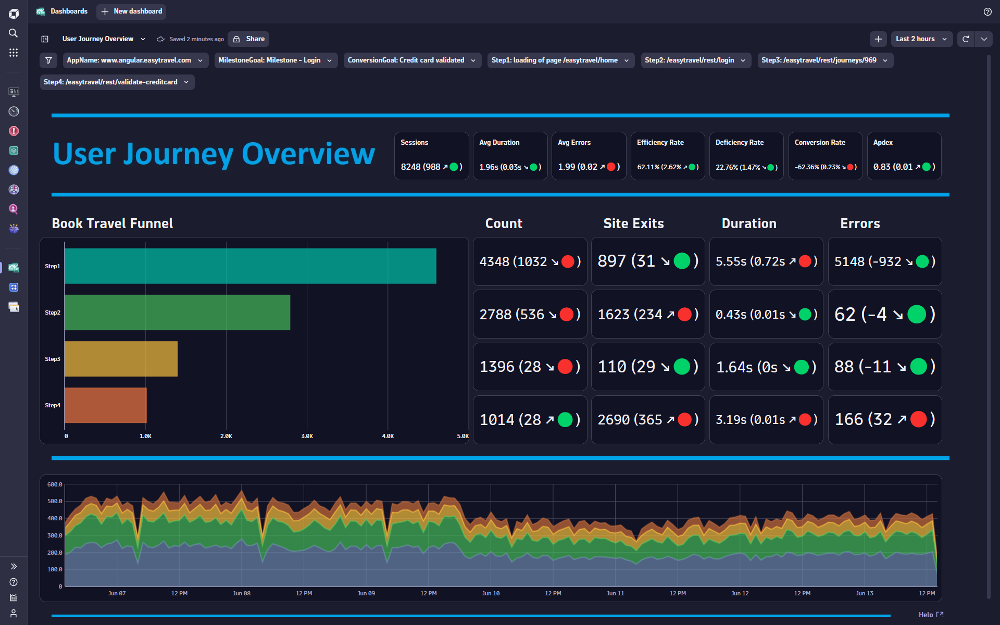
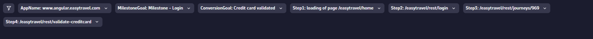
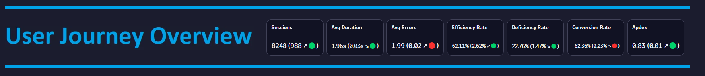
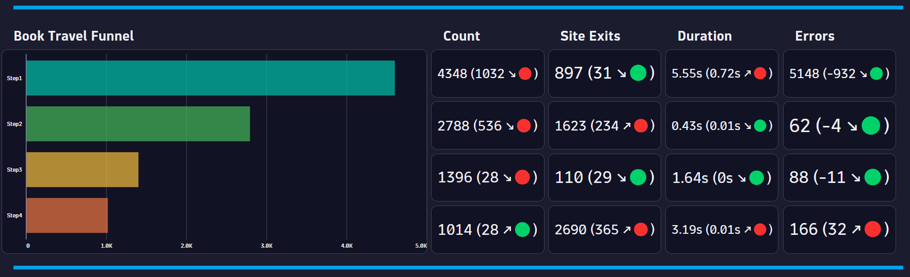
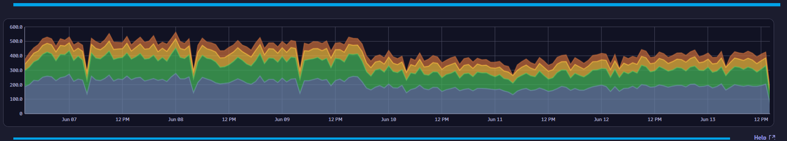

# User Journey Overview Dashboard

This dashboard provides a user journey overview for your application and identifies friction points within your user journey.

# Prerequisites

Required: [Create a conversion goal](https://www.dynatrace.com/support/help/platform-modules/digital-experience/web-applications/analyze-and-use/define-conversion-goals) for a user action that indicates the start of a business transaction (i.e. Login Page).

Required: [Create a conversion goal](https://www.dynatrace.com/support/help/platform-modules/digital-experience/web-applications/analyze-and-use/define-conversion-goals) for a user action that indicates a completed business transaction (i.e. Order Confirmation Page).

Required: [Configure Key User Actions](https://www.dynatrace.com/support/help/platform-modules/digital-experience/web-applications/additional-configuration/configure-key-user-actions-web) for each User Action that is part of your user journey.

# Target Audience

- Application Owner
- Line of Business
- Executive
- Web Developer

# Use Cases

- What is the APDEX for my application?
- Is my user traffic increasing?
- What user journey step has the most friction?
- Are users that interract with my user journey converting efficiently?
- Do I have a time where my user journey is experiencing high friction?

# Install Instructions

- Download https://github.com/TechShady/Dynatrace-Dashboards-Gen3/blob/main/User%20Journey%20Overview.json
- Launch the new Gen3 UI
- Select the Dashboard app
- In the upper righthand corner, select Upload and select your json file
- Refresh your dashboard list and launch your Dashboard

# User Guide

The User Journey Overview Dashboard is broken down into four sections.

The dashboard header section has multiple filters that you can apply to your User Journey Overview Dashboard:
- AppName - List of applications currently monitored by Dynatrace. Select the application to filter the dashboard for any application.
- MilestoneGoal - The conversion goal for you application that indicates the start of your user journey.
- ConversionGoal - The conversion goal for you application that indicates a converted session.
- Steps - List of Key User Actions for each step of your user journey.

The top section is called the KPI banner. This section has the following KPIs:
- Sessions: Total number of user sessions for your application.
- Avg Duration: Time between the initial user input and complete page load.
- Avg Errors: Average number of Request and JavaScript Errors.
- Efficiency Rate: Rate of sessions that converted with good user experience. A perfect efficiency rate is 100.
- Deficiency Rate: Rate of sessions that abandoned with poor user experience. A perfect deficiency rate is 0.
- Conversion Rate: Rate of sessions that converted.
- Apdex: Application Performance Index is a standard developed by an alliance of companies for measuring the performance of applications. A perfect Apdex score is 1.

Each KPI cell displays the current value for the last 24 hours. Each KPI is compared to a seven-day time shift over the past 24 hours and will display, in parentheses, the KPI difference and trend direction.

The middle section displays the user journey funnel. For each step, you will see the Step Count, Step Site Exit Count, Step Avg Duration and Step Error Count. Each cell displays the current value for the last 24 hours. Each cell is compared to a seven-day time shift over the past 24 hours and will display, in parentheses, the metric difference and trend direction.

The bottom section charts the user journey step counts over the last seven days.
