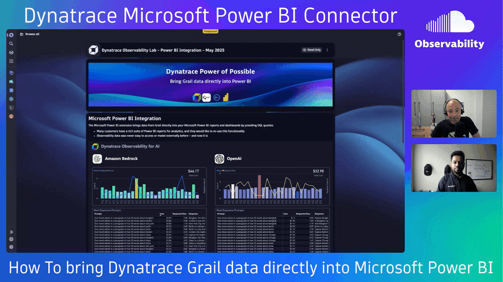

# Model observability data in Microsoft Power BI with the new Dynatrace Grail Connector

Access the [Microsoft Power BI Integration Launchpad](https://wkf10640.apps.dynatrace.com/ui/apps/dynatrace.launcher/launchpad/76694a05-e785-4166-9c08-8de369fcb750) shown in the session on the Dynatrace Playground Tenant!

## Video / Content

 **YouTube Video will be here shortly**

Dynatrace Grail is the Data Lakehouse that connects and stores your critical technical (logs, metrics, traces, events ... ) and business (SLOs, Real User Behavior, Business Events, Costs, ...) observability data.
While Dynatrace provides powerful built-in analytics and visualizations we see that many of our users have existing investments in Microsoft PowerBI.
In this session we have Imran Khan walk us through the new Dynatrace PowerBI Connector for Grail, allowing you to bring ANY data in Grail into your Microsoft PowerBI reports and dashboards. Tune in and learn how to easily connect your Power BI (Semantic Models), Power BI (Dataflows) and Fabric (Dataflow Gen2) with Dynatrace and enrich your reporting through the power of DQL (Dynatrace Query Language). Imran walks us through various use cases such as bringing Dynatrace AI/LLM Observability, Security Threat and Exploits, Host Deployment Overview or Log Analytics into PowerBI!

## Download Template Report

The templated used in the video can be [downloaded here](Dynatrace%20Grail%20Connector_Sample_Playground-Tenant_Report_05062025.pbit)

